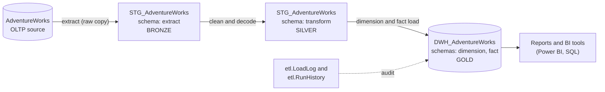
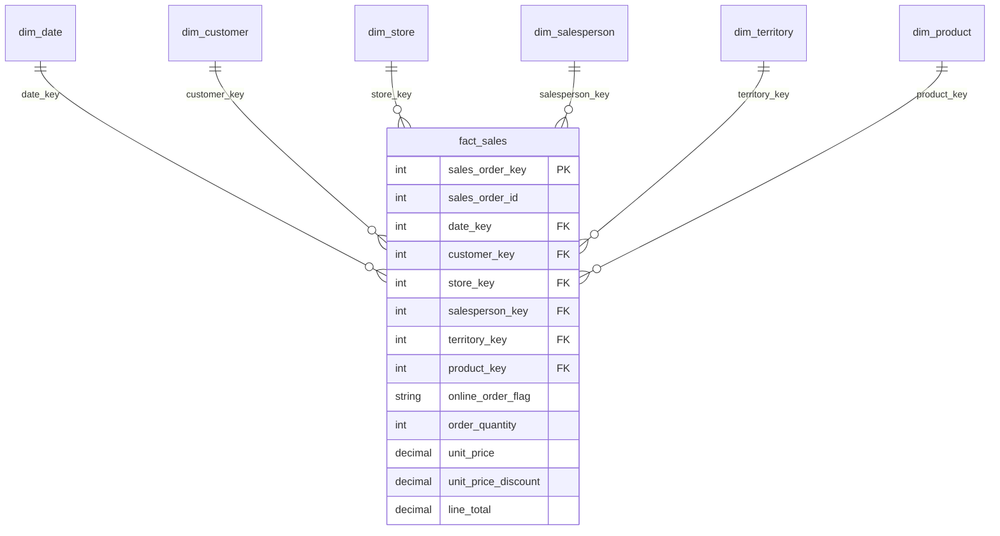

# AdventureWorks Sales Data Warehouse


A complete, working **data warehouse** for the Microsoft *AdventureWorks* sample company, built with **SQL Server** and **SSIS** using the **Kimball dimensional modeling** approach.
It turns raw order-processing data into a clean, fast, analysis-ready model that answers sales questions such as *"How much did we sell, where, to whom, and through which channel?"*

---

## Table of Contents

1. [In plain words](#1-in-plain-words)
2. [Business questions it answers](#2-business-questions-it-answers)
3. [Architecture](#3-architecture)
4. [Data model](#4-data-model)
5. [How the ETL works](#5-how-the-etl-works)
6. [Key design decisions](#6-key-design-decisions)
7. [Repository structure](#7-repository-structure)
8. [Getting started](#8-getting-started)
9. [Monitoring and data quality](#9-monitoring-and-data-quality)
10. [Naming conventions](#10-naming-conventions)
11. [Known limitations and roadmap](#11-known-limitations-and-roadmap)
12. [License and author](#12-license-and-author)
13. [خلاصه به فارسی](#13-خلاصه-به-فارسی)

---

## 1. In plain words

A company records every sale in an **operational system** (here: the `AdventureWorks` database). That system is built to *save* orders quickly, not to *analyze* them. Asking it "total sales per region per month" is slow, complicated, and risks slowing down the business.

This project builds a separate **reporting warehouse** next to it:

- A scheduled **pipeline** copies the data out, **cleans** it, and **shelves** it into a simple layout designed for questions.
- The layout is a **star**: one central table of sales (the *fact*) surrounded by descriptive tables (the *dimensions*: when, who, where, what).
- Every run is **logged**, so anyone can see what ran, when, how many rows changed, and whether anything failed.

Think of it as a factory: raw goods arrive (**extract**), are washed and sorted (**transform**), and are placed on labeled shelves (**load**), with a logbook at the door.

---

## 2. Business questions it answers

- Sales and quantity by **date** (Gregorian *and* Jalali / Iranian calendar), month, quarter, year
- Sales by **product**, category, subcategory, model
- Sales by **territory**, country, and territory group
- Sales by **customer** and by **store** (size, year opened, number of employees, specialty)
- Performance by **salesperson** (job title, hire date, employment status)
- **Online vs. reseller** orders
- Average discount and revenue per order line

Example:

```sql
-- Sales per territory per year
SELECT t.territory_name, d.gregorian_year, SUM(f.line_total) AS sales
FROM fact.fact_sales f
JOIN dimension.dim_territory t ON t.territory_key = f.territory_key
JOIN dimension.dim_date      d ON d.date_key      = f.date_key
WHERE f.sys_delete_date IS NULL
GROUP BY t.territory_name, d.gregorian_year
ORDER BY d.gregorian_year, sales DESC;
```

Because `dim_date` also carries Jalali columns (`jalali_year`, `jalali_quarter_name`, ...), the same query can be grouped by the Iranian fiscal calendar.

---

## 3. Architecture



| Layer | Database / schema | What lives there |
|---|---|---|
| Source | `AdventureWorks` (OLTP) | The original operational data. Never modified by the pipeline. |
| Bronze | `STG_AdventureWorks.extract` | An untouched copy of the 14 source tables the model needs. |
| Silver | `STG_AdventureWorks.transform` | Cleaned copy: nulls handled, codes decoded to readable text, date key derived. |
| Gold | `DWH_AdventureWorks.dimension`, `.fact` | The star schema used for analysis. |
| Audit | `DWH_AdventureWorks.etl` | `LoadLog` (per package) and `RunHistory` (per full run). |

---

## 4. Data model

**Business process:** Sales.
**Grain of the fact table:** *one row per sales order line item* (the most detailed level, so any total can be built from it).



### Fact table: `fact.fact_sales`

| Column group | Columns |
|---|---|
| Identifiers (kept from source) | `sales_order_key` (order-line ID, primary key), `sales_order_id` (order number) |
| Dimension keys | `date_key`, `customer_key`, `store_key`, `salesperson_key`, `territory_key`, `product_key` |
| Descriptive flag | `online_order_flag` (`Online` / `Reseller`) |
| Measures | `order_quantity`, `unit_price`, `unit_price_discount`, `line_total` |
| Audit columns | `sys_insert_date`, `sys_update_date`, `sys_delete_date`, `sys_hash_value`, `sys_data_source`, `sys_source_record_id` |

### Dimensions

| Dimension | Describes | Business key | History handling |
|---|---|---|---|
| `dim_date` | One row per calendar day, Gregorian and Jalali | `date_key` (`yyyymmdd`) | Static, pre-calculated |
| `dim_customer` | Customers, their store and territory | `account_number_bk` | **SCD Type 2** (full history, `is_current` flag) |
| `dim_product` | Product with category, subcategory, model, class, color, size, line | `product_code_bk` (product number) | SCD Type 1 (overwrite) |
| `dim_store` | Reseller stores: size, year opened, employees, specialty, brands | `source_id_bk` | SCD Type 1 |
| `dim_salesperson` | Sales representatives: name, job title, hire date, status | `national_number_bk` | SCD Type 1 |
| `dim_territory` | Sales territory, group, country | `source_id_bk` | SCD Type 1 |

Every dimension also contains an **Unknown member** (surrogate key `-1`) so that facts with a missing relationship (for example an online order that has no salesperson) are kept and clearly labeled instead of being dropped.

> **SCD** = *Slowly Changing Dimension*. Type 1 overwrites old values; Type 2 keeps every version so history stays correct.

Reference documents: [`docs/enterprise_data_warehouse_bus_matrix.xlsx`](docs/enterprise_data_warehouse_bus_matrix.xlsx) (bus matrix) and [`docs/sales_adventureworks_erd.png`](docs/sales_adventureworks_erd.png) (source ERD).

---

## 5. How the ETL works

The whole chain is started by one package, **`Master.dtsx`**:

```
SQL | Run Start            -> writes a "Running" row in etl.RunHistory
  -> EPT | Extract Layer       (extract_layer.dtsx)
  -> EPT | Transform Layer     (transform_layer.dtsx)
  -> SEQ | Dimensions Load     (5 dimension packages, in parallel)
        dim_customer | dim_product | dim_store | dim_territory | dim_salesperson
  -> EPT | Load FactSales      (fact_sales.dtsx, only after ALL dimensions finish)
  -> SQL | Run Success         -> closes the RunHistory row
```

| Package | Role |
|---|---|
| `Master.dtsx` | Orchestrator. Runs everything in the right order and records the run. |
| `extract_layer.dtsx` | Empties and refills 14 bronze tables, one data flow per source table. |
| `transform_layer.dtsx` | Builds the silver tables: handles nulls, decodes codes (for example flags to `Active`/`Terminated`, `Online`/`Reseller`), derives `DateKey`. |
| `dim_*.dtsx` (x5) | Load one dimension each. Independent of each other, so they run in parallel. |
| `fact_sales.dtsx` | Loads the fact table after all dimensions are ready (it needs their keys). |

### The load pattern used by every dimension and the fact

1. Read the cleaned rows from the silver layer.
2. Compute a **hash** (a 64-character fingerprint) of the business columns.
3. Look the row up in the warehouse by its **business key**:
   - **Not found** -> insert as a new row.
   - **Found, hash differs** -> something changed: update it (Type 1) or close the old version and insert a new one (Type 2, customers only).
   - **Found, hash identical** -> nothing to do (this keeps reruns cheap and safe).
4. Rows that exist in the warehouse but no longer exist in the source are **soft-deleted** (`sys_delete_date` is set; nothing is physically removed).
5. Write the outcome (rows inserted / updated / deleted, or the error) to `etl.LoadLog`.

For the fact table, new order lines receive their dimension keys through lookups (anything unmatched becomes `-1`, "Unknown"). Existing lines only have their measures refreshed, so a later change in a dimension (for example a customer moving territory) never rewrites history.

The pipeline is **idempotent**: running it twice in a row produces `0` inserts, `0` updates, `0` deletes on the second run.

---

## 6. Key design decisions

| Decision | Why |
|---|---|
| Star schema, grain = order line | Most detailed grain; any total (order, day, product) can be derived without loss. |
| Medallion layers (bronze / silver / gold) | Separates "copy as-is", "make it clean", and "make it useful"; failures are easy to locate and rerun. |
| One package per layer and per dimension, plus a Master | A failed dimension can be rerun alone; dimensions run in parallel. |
| Hash-based change detection | One comparison instead of column-by-column checks; fast and simple. |
| SCD2 only for customers | History matters for who/where a customer was; for other dimensions overwriting is enough. |
| Soft delete, never `TRUNCATE` on dimensions | Keeps history and keeps fact keys valid. |
| Unknown member (`-1`) in every dimension | No fact row is ever lost because of a missing relationship. |
| Order-header amounts (`Freight`, `TaxAmt`, `SubTotal`, `TotalDue`) are **not** in the line-grain fact | Repeating one order-level amount on every line would inflate totals when summed. |
| Source line ID used directly as fact primary key | It is verified unique and stable, so no extra surrogate key is needed. |
| Full snapshot loads | The source is a static sample database; incremental loading is listed in the roadmap. |
| Date dimension with Jalali calendar | Needed for Iranian fiscal-year reporting. |

---

## 7. Repository structure

```
dwh-adventureworks/
├── README.md
├── LICENSE
├── docs/
│   ├── enterprise_data_warehouse_bus_matrix.xlsx   # bus matrix: processes x dimensions
│   ├── sales_adventureworks_erd.png                # source (OLTP) ERD for the sales area
│   ├── naming_conventions.md                       # general naming rules
│   └── ssis_component_naming.md                    # SSIS component naming playbook
├── scripts/                                        # SQL, run in the order shown in section 8
│   ├── init_stg_database.sql                       # creates STG_AdventureWorks + schemas
│   ├── init_dwh_database.sql                       # creates DWH_AdventureWorks + schemas
│   ├── extract_layer_ddl.sql                       # bronze tables
│   ├── transform_layer_ddl.sql                     # silver tables
│   ├── load_layer_ddl.sql                          # dimensions, fact, and Unknown members
│   └── audit_logs_ddl.sql                          # etl.LoadLog and etl.RunHistory
├── etl/
│   └── ssis/BI Solution/                           # Visual Studio SSIS solution
│       └── ETL/
│           ├── Master.dtsx
│           ├── extract_layer.dtsx
│           ├── transform_layer.dtsx
│           ├── dim_customer.dtsx  dim_product.dtsx  dim_store.dtsx
│           ├── dim_territory.dtsx  dim_salesperson.dtsx
│           ├── fact_sales.dtsx
│           ├── OLTP.conmgr  STG.conmgr  DWH.conmgr # project connection managers
│           └── Project.params                      # project parameters (e.g. NullString)
└── test/
    ├── source-discovery.sql                        # profiling of the source: structure, volumes, grain
    └── check_dwh_quality.sql                       # data-quality and reconciliation checks
```

---

## 8. Getting started

### Prerequisites

- **SQL Server** (a recent version) and **SQL Server Management Studio**
- **Visual Studio** with the **SQL Server Integration Services Projects** extension
- The Microsoft **AdventureWorks (OLTP)** sample database restored as `AdventureWorks`

### Steps

1. **Restore** the AdventureWorks OLTP sample database.
2. **Create the databases and tables.** Run the scripts in this order:
   1. `scripts/init_stg_database.sql`
   2. `scripts/init_dwh_database.sql`
   3. `scripts/extract_layer_ddl.sql` (staging database)
   4. `scripts/transform_layer_ddl.sql` (staging database)
   5. `scripts/load_layer_ddl.sql` (warehouse database)
   6. `scripts/audit_logs_ddl.sql` (warehouse database, `etl` schema)
3. **Open** `etl/ssis/BI Solution/BI Solution.slnx` in Visual Studio.
4. **Point the three connection managers** (`OLTP`, `STG`, `DWH`) to your SQL Server instance.
5. **Run** `Master.dtsx`.
6. **Verify** the result (section 9).

The packages can also be deployed from the built project file (`ETL.ispac`) to the SSIS catalog and scheduled with SQL Server Agent.

Expected volumes after the first run: about 31 thousand orders, 121,317 order lines in `fact_sales`, roughly 19 thousand customers, 701 stores, 504 products, 10 territories, 17 salespeople.

---

## 9. Monitoring and data quality

**What ran, when, and what changed:**

```sql
SELECT TOP (20) log_id, package_name, start_time, end_time, status,
       rows_inserted, rows_updated, rows_deleted, error_source, error_message
FROM DWH_AdventureWorks.etl.LoadLog
ORDER BY log_id DESC;

SELECT * FROM DWH_AdventureWorks.etl.RunHistory ORDER BY run_id DESC;
```

- `etl.LoadLog`: one row per package execution (`Running` / `Success` / `Failed`), with row counts and the error text when something fails.
- `etl.RunHistory`: one row per full `Master` run, giving end-to-end duration and overall status.

**Quick health checks** (see `test/check_dwh_quality.sql`):

- Row count of `fact.fact_sales` equals the number of order lines in the source.
- No fact row points to a dimension key that does not exist (orphan check).
- The count of `-1` ("Unknown") keys is explainable: online orders have no salesperson, and individual customers have no store.
- A second consecutive run reports `0` inserted, `0` updated, `0` deleted.

---

## 10. Naming conventions

- `snake_case`, English names, no SQL reserved words.
- Tables: `dim_<entity>`, `fact_<process>`.
- Surrogate keys end with `_key`; business keys end with `_bk`.
- System/audit columns start with `sys_` (`sys_insert_date`, `sys_hash_value`, ...).
- SSIS components follow `TYPE | Action | Object`, for example `DFT | Extract Product`, `LKP | Customer`, `DER | Handle Null Attributes`.

Details: [`docs/naming_conventions.md`](docs/naming_conventions.md) and [`docs/ssis_component_naming.md`](docs/ssis_component_naming.md). Where the general naming document differs from the implemented objects (for example the audit-column prefix), the SQL in `scripts/` is the source of truth.

---

## 11. Known limitations and roadmap

Deliberately left out of this first version, in rough priority order:

- [ ] **Incremental loading** (change tracking / watermark). Currently every run reads full snapshots; fine for the sample data, not for large production volumes.
- [ ] **Environment parameterization and CI/CD** (Dev / Test / Prod connection settings, automated deployment).
- [ ] **Reject-row quarantine table** for bad source rows (today they either fail the load or fall back to *Unknown*).
- [ ] **Order-level fact** for header amounts (freight, tax, total due) so they can be analyzed without double counting.
- [ ] **Promotions** (`SpecialOffer`) as a dimension.
- [ ] `online_order_flag` currently stores a text label in the fact table; a tiny channel dimension would be leaner at scale.
- [ ] Column-name typo `job_tiltle` in `dim_salesperson` to be corrected in a coordinated rename.

**Security note:** `dim_salesperson` uses the employee national ID number as its business key. That is acceptable for this public sample dataset only. In a real project, use a non-sensitive key and obtain approval from the data owner before moving personal data into the warehouse.

---

## 12. License and author

Released under the [MIT License](LICENSE). Copyright (c) 2026 Mahdi Djavadi.

Contributions, questions, and suggestions are welcome through issues and pull requests.

---

## 13. خلاصه به فارسی

این پروژه یک **انبار داده (Data Warehouse)** کامل برای فروش شرکت نمونه‌ی AdventureWorks است که با **SQL Server** و **SSIS** و روش **Kimball** (مدل ستاره‌ای) ساخته شده است.

- **هدف:** پاسخ سریع و قابل اعتماد به سؤال‌هایی مثل «فروش هر منطقه، محصول، فروشنده و کانال (آنلاین/حضوری) در هر ماه چقدر بوده؟» بدون فشار آوردن به سیستم عملیاتی.
- **ساختار:** سه لایه‌ی Bronze (کپی خام)، Silver (تمیزسازی) و Gold (مدل تحلیلی). جدول مرکزی `fact_sales` است (هر ردیف = یک قلم سفارش) و شش بُعد دارد: تاریخ (میلادی و **شمسی**)، مشتری، فروشگاه، فروشنده، منطقه فروش، محصول.
- **اجرا:** یک پکیج اصلی (`Master.dtsx`) همه‌چیز را به ترتیب اجرا می‌کند: استخراج، تمیزسازی، بارگذاری پنج بُعد به‌صورت موازی و سپس جدول فکت.
- **قابلیت اطمینان:** تشخیص تغییر با Hash، نگهداری تاریخچه‌ی مشتری (SCD2)، حذف نرم به‌جای حذف فیزیکی، ردیف «نامشخص» (کلید `-1`) در هر بُعد، و ثبت کامل هر اجرا در جدول‌های `etl.LoadLog` و `etl.RunHistory`.
- **اجرای اولیه:** پایگاه داده‌ی AdventureWorks را restore کنید، اسکریپت‌های پوشه‌ی `scripts` را به ترتیب اجرا کنید، سه Connection را در پروژه‌ی SSIS تنظیم کنید و `Master.dtsx` را اجرا کنید.
- **نقشه‌ی راه:** بارگذاری افزایشی (Incremental)، CI/CD و محیط‌های جدا، جدول ردیف‌های ردشده، و فکت جداگانه برای مبالغ سطح سفارش.
